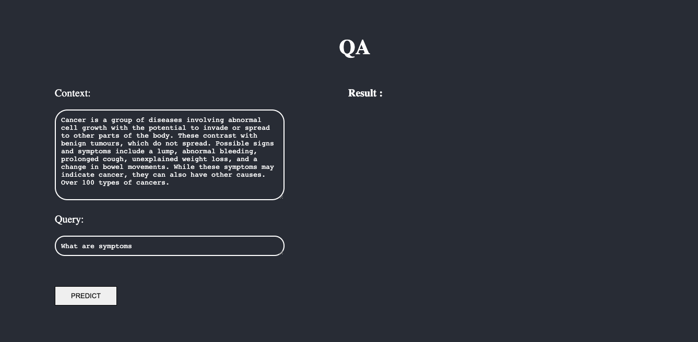
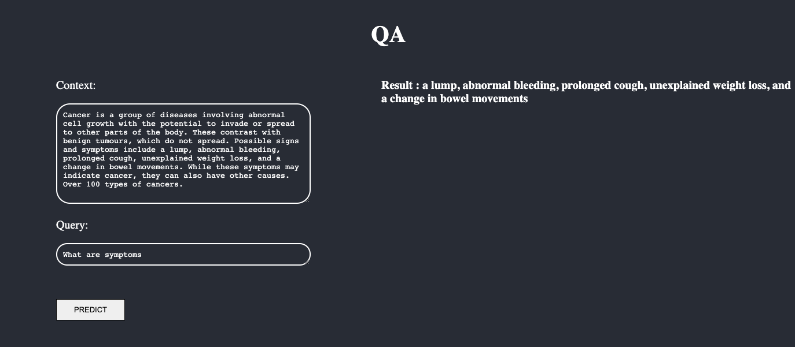

Question Answering has become one of the most important problems in modern NLP research. In this project, I have tried to implement a Q and A system using Facebook's roBERTa, fine-tuned on SQuAD_2.0(Stanford Question and Answering Dataset)

# Tools:

Tensorflow(v2.1.0)

Keras(v3.0)

Huggingface's Transformer library
(Note : Huggingface does not have a question and answering head for RoBERTa in Tensorflow. I have used a custom QA_head in this projet which will be described with the architecture)

Huggingface's Tokenizer library

Numpy

Pandas

Sklearn

Flask

HTML/CSS

# Stanford Question and Answering Dataset (SQuAD):
The Data consists of multiple titles, each having multiple contexts/documents, each context having multiple questions and answers. Each answer is provided with the start index. The questions can be seen as queries to each passage and the answers can be seen as a span in each context.
For better understanding, I have converted the json file to a csv file(SQuAD_understanding.ipynb)

# Task:
Given a question and corresponding context, predict the span of the answer in the context using a start and end logit.

# Creating Input Features:
While training, the goal is to first create start and end logits for each context for a particular question. The start index is already given and using the length of the answer, the end index is determined.

We then make a mask(list) which is the size of the context. Those positions which contain the answer are given the value of 1 whereas others are given the value of 0.

The next step is to create offsets for each token in the context and appending those tokens whose offset span contain ones to a list. This list now contains the tuples holding the positions of those tokens present in the answer.
Thus, the start token becomes the first tuple in the list whereas the end token becomes the last tuple in the list.

# Model:
 
 Input - Input tokens, attention mask, token type ids(Note: attribute token type ids is not required for this tasks so it remains a numpy array of zeros)
 
 1) Input tokens - The input to the RoBERTa model is of the following format for Q and A tasks.
 
 <s> Question </s></s> Answer </s>(The Questions and Answers are in the form of token ids)
 
 On top of the twelve encoder layers of RoBERTa, I have built a custom QA head using two heads, one giving the start logit and the other the end logit. Each head is a 1D ConvNet with a softmax function.
 
 
# Training:

Learning Rate = 3e-5 (As specified in the paper)
Loss - categorical_crossentropy
Optimizer - Adam
Batch Size - 4(Due to computational limitations. Not: For optimal results, as specified in the bert paper, batch size must be equal to 32 or 64)
Epochs = 3/4 (As specified in the paper)

# Results:

Sample context:
'Cancer is a group of diseases involving abnormal cell growth with the potential to invade or spread to other parts of the body. These contrast with benign tumours, which do not spread. Possible signs and symptoms include a lump, abnormal bleeding, prolonged cough, unexplained weight loss, and a change in bowel movements. While these symptoms may indicate cancer, they can also have other causes. Over 100 types of cancers.'

# Further Work:

Document Strides

Testing Metrics
